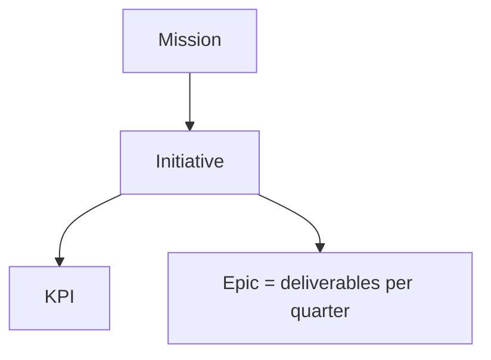

# Roadmap

This folder is where we plan and communicate the product roadmap. It is a
**strategy-documentation layer**, written as Markdown with embedded
[Mermaid](https://mermaid.js.org/) diagrams that **GitHub renders natively** —
open any file here in the GitHub UI and the diagrams show up as pictures.

It is intentionally **separate from the live app's OKR data** (the Supabase
Objectives / Key Results you edit in the dashboard). The app stays the source of
truth for day-to-day OKR tracking; this folder is the longer-horizon narrative
of where we're going and why.

## The hierarchy (high → low)

| Level | What it is | Where it lives |
| --- | --- | --- |
| **Mission** | The single north-star statement. | `mission.md` |
| **Initiative** | A strategic bet that advances the mission. | one file per initiative in `initiatives/` |
| **KPI** | A measurable indicator of an initiative's success. | inside each initiative file |
| **Epic** | A concrete deliverable, scheduled in a quarter. | inside each initiative file (Gantt) |

## Diagram convention (which diagram for which level)

- **Mission → Initiatives → KPIs** — a `mindmap` in [`mission.md`](./mission.md)
  gives the whole tree at a glance.
- **Initiative → its KPIs** — a `flowchart LR` at the top of each initiative
  file shows the initiative and the KPIs it moves.
- **Epics per quarter** — a `gantt` chart per initiative, with one `section` per
  quarter, so deliverables read as a quarterly timeline.

Keep to these so every file looks the same and is easy to scan.

## How to add an initiative

1. Copy [`_templates/initiative.md`](./_templates/initiative.md) into
   `initiatives/<short-slug>.md`.
2. Fill in the placeholders (`<…>`): the KPI flowchart, the quarterly epic
   Gantt, and the prose.
3. Add the initiative (and its KPIs) to the `mindmap` in
   [`mission.md`](./mission.md) and to the index below.
4. Open a PR. CI validates that every Mermaid diagram parses (see
   `.github/workflows/roadmap.yml`); a human reviews and merges, same as code.

## Index

- [Mission](./mission.md)
- Initiatives:
  - [Example — Grow active teams](./initiatives/example-growth.md) *(worked example; replace with real initiatives)*
