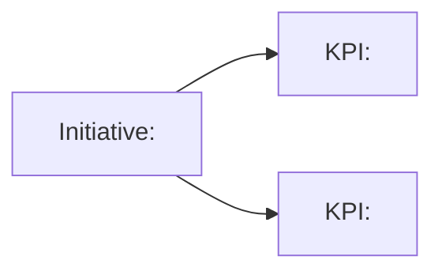

<!--
  Initiative template. Copy this file to `roadmap/initiatives/<short-slug>.md`
  and replace every <placeholder>. Then add the initiative + its KPIs to the
  mindmap and index in `roadmap/mission.md`.

  Keep the three diagrams below in this order so every initiative reads the same:
  1) flowchart  — the initiative and the KPIs it moves
  2) gantt      — the epics (deliverables), one section per quarter
  3) prose      — context, KPI definitions, notes
-->

# Initiative: `<Initiative name>`

- **Owner:** `<name>`
- **Status:** `<🟢 On track | 🟡 At risk | 🔴 Off track>`
- **Advances mission by:** `<one line on how this bet moves the mission>`
- **Last updated:** `<YYYY-MM-DD>`

## KPIs



| KPI | Definition | Baseline → Target |
| --- | --- | --- |
| `<metric 1>` | `<how it's measured>` | `<from>` → `<to>` |
| `<metric 2>` | `<how it's measured>` | `<from>` → `<to>` |

## Epics by quarter

```mermaid
gantt
  title <Initiative name> — Epics by quarter
  dateFormat YYYY-MM-DD
  section Q1 <year>
    <Epic 1>            :<status>, e1, <YYYY-MM-DD>, <YYYY-MM-DD>
  section Q2 <year>
    <Epic 2>            :<status>, e2, <YYYY-MM-DD>, <YYYY-MM-DD>
  section Q3 <year>
    <Epic 3>            :<status>, e3, <YYYY-MM-DD>, <YYYY-MM-DD>
```

<!-- Gantt task status keywords: `done`, `active`, or leave blank for upcoming. -->

## Notes

`<Context, scope, dependencies, risks, links to related OKRs in the app.>`
