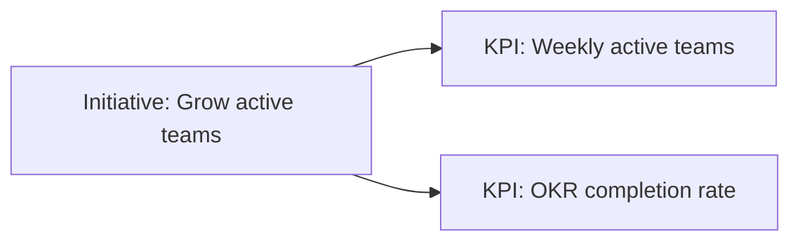
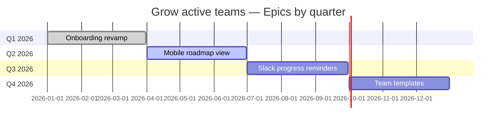

# Initiative: Grow active teams

> ⚠️ **Worked example with placeholder content.** It shows how all four levels
> (mission → initiative → KPI → epic) connect. Replace it with a real initiative
> or delete it once you have your own.

- **Owner:** Roel
- **Status:** 🟢 On track
- **Advances mission by:** more teams running OKRs weekly means the tool is
  actually changing how teams work, not just storing data.
- **Last updated:** 2026-06-27

## KPIs

| KPI | Definition | Baseline → Target |
| --- | --- | --- |
| Weekly active teams | Distinct teams that updated ≥1 key result in the last 7 days | 4 → 12 |
| OKR completion rate | Share of objectives reaching ≥70% progress by their end date | 45% → 65% |

## Epics by quarter

## Notes

- **Onboarding revamp** shipped in Q1 and drove the first jump in weekly active
  teams.
- **Mobile roadmap view** is in flight — it should help owners check in from the
  iPad, supporting the weekly-active KPI.
- Later epics (reminders, templates) are scoped but not yet committed; dates are
  placeholders to be confirmed at quarterly planning.
