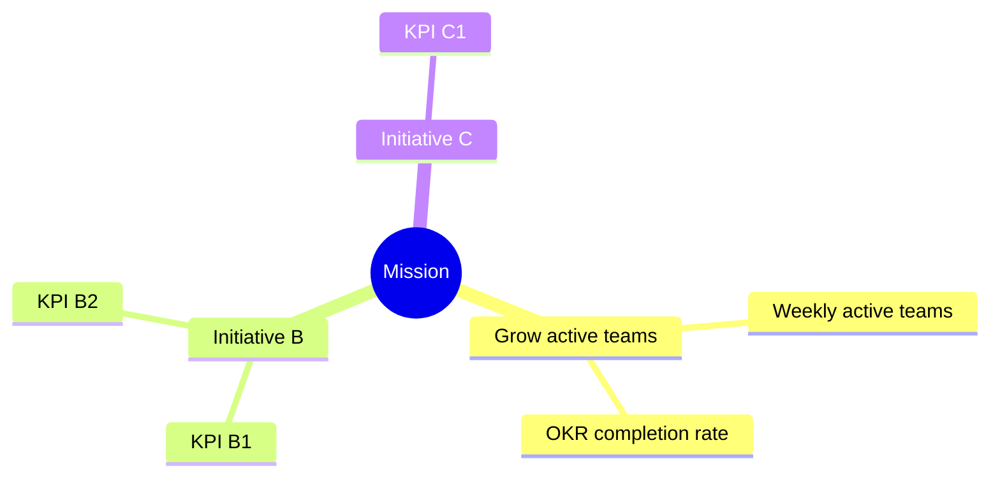

# Mission

> **`<One sentence: the north-star outcome we exist to achieve.>`**
>
> _Example placeholder:_ "Help every team set, track, and hit OKRs that matter —
> without the busywork."

This is the top of the roadmap hierarchy. Everything below — initiatives, KPIs,
and quarterly epics — exists to move this mission forward.

## The whole picture: Mission → Initiatives → KPIs

> Replace the example branches above with real initiatives and their KPIs. Each
> top-level branch should map to one file in [`initiatives/`](./initiatives/).
> Keep node labels short — the per-initiative files hold the detail.

## Initiatives

| Initiative | Owner | Status | File |
| --- | --- | --- | --- |
| Grow active teams *(example)* | `<owner>` | 🟢 On track | [initiatives/example-growth.md](./initiatives/example-growth.md) |
| `<Initiative B>` | `<owner>` | — | `<initiatives/...md>` |

See [README.md](./README.md) for conventions and how to add an initiative.
